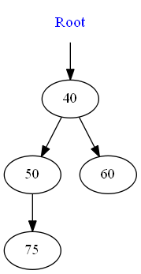

MIN HEAP
====================
Building with Travis: 

This repository has a project with the implementation of a MIN HEAP.

It is written in C++.

The code of the MIN HEAP is independent of platform.

Is has two possible main files:

* [Codes](#markdown-header)
	* [A main that triggers unit test;](#markdown-header-emphasis)

	* [A Qt project to manage the MIN HEAP (With Gui).](#markdown-header-strikethrough)
	
The library used to make the Unit Test is the Catch v2.12.3. The code is already in this repository.

The Qt project generates images of the MIN HEAP, using the lib Graphviz.
Install this lib in your computer for you to be able to create such images.

The code was written containing the Doxygen documentation.

- - -

You have several options to build the project: 
====================

* [Build tools](#markdown-header)
	* [Makefile (using the file named MakefileGeneral);](#markdown-header-emphasis)
	* [CMake.](#markdown-header-emphasis)
	* [Qt Project (With QMake).](#markdown-header-emphasis)

The project has no leaks (Fully tested with Valgrind).

All the unit tests are ok.

- - -

The functionalities available are: 
====================

* [Functionalities](#markdown-header)
	* [Insert;](#markdown-header-emphasis)
	* [Remove minimum number;](#markdown-header-emphasis)
	
- - -

Sample images: 
====================

Insertion steps: 
====================

## Initial

## Inserting 40

## Inserting 50

## Inserting 75

## Inserting 35

## Inserting 20

## Inserting 60

## Inserting 4

## Inserting 2

Remove min steps: 
====================

## Initial

## Removing min

## Removing min

## Removing min

## Removing min

## Removing min

## Removing min

## Removing min

## Removing min

Qt gui project: 
====================
The qt gui application gui is shown below:

